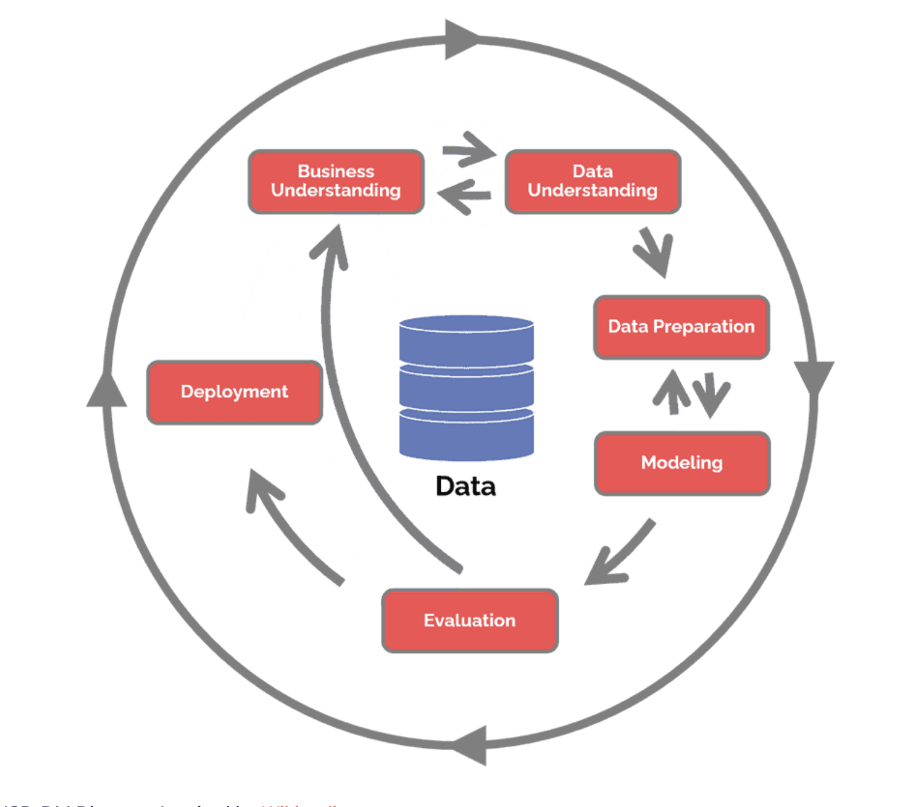
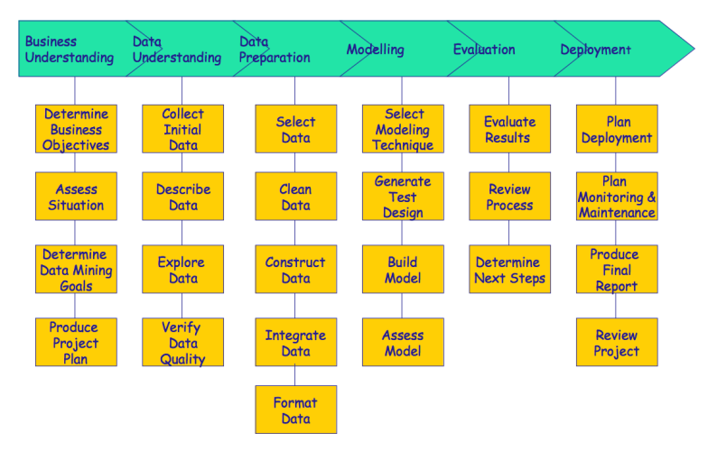

# AC_proj

- relation awards_players (96 objects) - each record describes awards and prizes received by players across 10 seasons,
- relation coaches (163 objects) - each record describes all coaches who've managed the teams during the time period,
- relation players (894 objects) - each record contains details of all players,
- relation players_teams (1877 objects) - each record describes the performance of each player for each team they played,
- relation series_post (71 objects) - each record describes the series' results,
- relation teams (143 objects) - each record describes the performance of the teams for each season,
- relation teams_post (81 objects) - each record describes the results of each team at the post-season.

### Series Post Analysis

- Each year has 8 teams participating, 7 series (A-G) and 3 rounds:
    - A-D: FR (First Round) - team A only plays against team B in a best of three matches. 
    - E-F: CF (Conference Finals) - after that the 4 winning teams (in each best-of-3) move on to this stage and team A plays against team B in a best of three.
    - G: F (Finals) - the 2 winning teams play a best of three (year 1-5,7) or best of five (year 6,8-10) to decide the champion.

- There are 20 unique teams in the course of all the 10 years.
